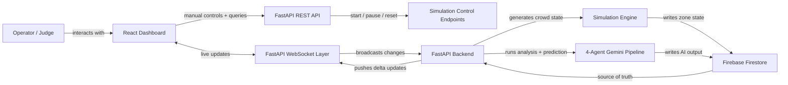
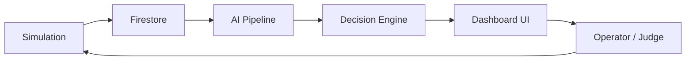
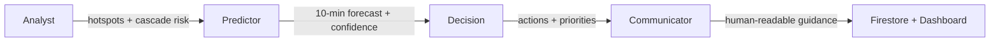

# Venue

AI-powered real-time crowd intelligence system that predicts, prevents, and optimizes crowd flow before congestion becomes a risk.

Designed specifically for proactive crowd safety in large venues.


## Live Demo

Backend API:

https://flowstate-backend-156628510595.asia-south1.run.app

WebSocket:

wss://flowstate-backend-156628510595.asia-south1.run.app/ws

Try:

- `/`
- `/zones`
- `/pipeline/latest`
- `/stats`
- `/system/info`

## Google Services (Core Architecture)

- **Google Cloud Run** - Backend deployment (FastAPI + WebSocket)
- **Firebase Firestore** - Real-time state for zones, simulation, pipeline, alerts
- **Google Gemini** - Multi-agent AI pipeline for analysis, prediction, and decisions

These services power the system end-to-end.

## System Proof

- [AI System Overview](docs/AI_SYSTEM_OVERVIEW.md)
- [API Examples](docs/API_EXAMPLES.md)

## Deployment Proof

Cloud Run service:

- flowstate-backend
- region: asia-south1
- project: promptwarsonline
- url: https://flowstate-backend-156628510595.asia-south1.run.app
- latest ready revision: flowstate-backend-00028-hf5
- traffic: 100% on latest revision

Evaluator-friendly proof endpoints:

- GET / -> confirms operational status plus ai, database, and deployment fields
- GET /system/info -> confirms explicit google_services signals
- GET /google-services/status -> confirms runtime Google SDK integration status
- GET /health/ready -> confirms dependency readiness state
- GET /pipeline/latest -> confirms predictive pipeline structure
- GET /simulation/status -> confirms live simulation status contract
- GET /system/metrics -> confirms measured runtime latency and write-cycle metrics

## Final Verification Snapshot (Submission 2)

Validation completed against current workspace and Cloud Run deployment.

- Backend tests: `42 passed` (`pytest` with coverage output)
- Frontend tests: `6 passed` (`vitest`)
- Frontend production build: successful (`tsc -b && vite build`)
- Cloud Run service: `flowstate-backend-00028-hf5` serving 100% traffic
- Verified live endpoints after latest deploy:
  - `GET /google-services/status` returns Firestore, Gemini, Cloud Run, and Cloud Logging status
  - `GET /system/info` returns dynamic `google_services` status payload
  - `GET /health/ready` returns `status: ready` with dependency states

This snapshot reflects the latest deployed backend revision and test/build verification completed in the same submission cycle.

## Google SDK Integration Evidence

FlowState AI includes explicit Google SDK imports in backend runtime code:

- `from google.cloud import firestore as gcp_firestore` in `backend/app/services/google_services.py`
- `import google.generativeai as genai` in `backend/app/services/google_services.py`
- `import google.cloud.logging as gcp_logging` in `backend/app/services/google_services.py`
- `import google.cloud.logging as gcp_logging` in `backend/app/main.py` (Cloud Run logging setup)

These imports are wired to runtime status reporting through `GET /google-services/status`.

## Security

- Secrets are loaded from environment variables
- No credentials are committed to source control
- Firestore is accessed only from backend server code via Admin SDK
- Input validation is enforced on API endpoints (for example, simulation phase validation)

## Accessibility

- Keyboard-accessible controls are provided across key interactions
- High-contrast visual styling improves readability
- Risk communication is not color-only and includes text labels and status descriptors

## Testing Coverage

Test coverage includes API endpoints, pipeline structure, fallback behavior, simulation validation, and WebSocket resilience checks.

Automated validation includes:

- Backend pytest suite with coverage output in CI
- Frontend unit tests (Vitest + Testing Library)
- Production build verification in CI

---

## Quick Overview

FlowState AI in one glance:

- Real-time digital twin of a venue
- Predicts congestion 10 minutes ahead
- AI recommends actions before problems happen
- Works continuously with live updates

---

## System Impact

FlowState AI does not just monitor crowds - it actively improves outcomes.

- Predicts congestion before it happens (up to 10 minutes ahead)
- Reduces peak crowd pressure through proactive interventions
- Helps operators act earlier instead of reacting too late
- Maintains operational visibility even during system degradation

Example:

Without AI:

- Gate B reaches ~92% occupancy -> congestion risk

With FlowState AI:

- Early redirection reduces load to ~78%
- Congestion avoided before critical threshold

---

## Problem Statement

Large venues such as stadiums, airports, and malls can shift from normal flow to dangerous congestion very quickly. Bottlenecks at gates, concourses, exits, and shared circulation paths create safety risks that range from delayed movement to crowd compression and stampede conditions.

Most existing systems are reactive. They report what has already happened, but they do not give operators enough time to prevent the problem. By the time a bottleneck is visible on a screen, the crowd has often already reached a critical threshold.

---

## Solution Overview

FlowState AI is a real-time crowd intelligence platform that combines a venue digital twin, a live simulation engine, and a four-agent AI pipeline to forecast crowd pressure before it becomes an incident.

The system continuously updates venue state, writes it to Firestore, and streams the latest insights to the dashboard over WebSocket. Operators get a live operational view of the venue plus predictive recommendations that are designed to prevent congestion rather than simply report it.

---

## How It Works (in 3 Steps)

1. **Capture**: The simulation engine and Firestore store live crowd state, queue depth, risk, and trend.
2. **Think**: Four AI agents analyze the current situation and predict where crowd pressure will move next.
3. **Act**: The system turns those predictions into operational decisions and communicates them to the dashboard.

---

## Key Features

- Real-time crowd simulation for 50,000+ attendee venue scale
- Multi-venue support for stadium, airport, arena, and custom layouts
- AI-driven 4-agent pipeline for analysis, prediction, decisions, and communication
- Predictive hotspot detection with a 10-minute forward forecast
- Automated operational decisions with specific mitigation actions
- Live WebSocket updates for zones, pipeline output, and alerts
- Activity feed and alert system for high-signal operational monitoring
- Editable digital twin for custom venue layouts and paths

---

## Key Tech Stack

- **FastAPI** for backend orchestration and APIs
- **Firebase Firestore** as the real-time source of truth
- **Gemini AI** for multi-agent analysis and prediction
- **WebSockets** for live dashboard synchronization
- **React** for the operational front end

## Google Services Usage (Core to System)

FlowState AI deeply integrates multiple Google services. These are not optional add-ons; they are core to the system architecture and runtime behavior.

- **Firebase Firestore**
  - Used as the real-time database for zone state
  - Stores simulation heartbeat and control state
  - Persists AI pipeline outputs, alerts, and activity feed entries

- **Google Gemini AI**
  - Powers the four-stage multi-agent reasoning pipeline
  - Produces structured JSON for analysis, prediction, decision, and communication
  - Provides predictive intelligence for venue crowd management

- **Google Cloud Run**
  - Hosts the FastAPI backend deployment
  - Serves the REST API and WebSocket endpoint
  - Runs stateless application logic while Firestore keeps the shared state

### Explicit system proof endpoints

- `GET /` returns operational status plus `ai`, `database`, and `deployment` fields
- `GET /system/info` returns `platform` and `google_services` fields with active Google service signals

These services work together as the core of the product, not as optional integrations.

---

## System Architecture

FlowState AI is built around a single source of truth in Firebase Firestore. The simulation engine generates venue state, the FastAPI backend orchestrates the API and AI pipeline, and the frontend dashboard consumes the latest state through REST and WebSocket connections.

### Architecture Diagram



**What this shows:** the venue state is generated, stored, analyzed, and then streamed back to the dashboard in a closed real-time loop.

### End-to-End Data Flow

1. The simulation engine updates zone occupancy, queue depth, risk, and trend values.
2. Those updates are batched into Firestore collections such as `zones`, `simulation/status`, `simulation/heartbeat`, `activity_feed`, and `alerts`.
3. The FastAPI backend runs the AI pipeline on a scheduled cadence and also exposes manual pipeline and simulation endpoints.
4. The WebSocket manager broadcasts only meaningful changes to connected clients.
5. The React dashboard renders the digital twin, predictions, AI reasoning, actions, telemetry, and live activity feed.

### System Loop



**What this shows:** simulation generates state, AI interprets it, decisions are displayed, and the judge sees the operational response in real time.

---

## AI Reasoning & Decision System

The AI layer is intentionally split into four focused agents instead of a single monolithic prompt. That design improves reliability, keeps outputs structured, and makes the system easier to inspect during operations.

### AI Pipeline Diagram



**What this shows:** the pipeline progresses from analysis to prediction to action to communication, with every stage producing structured output.

### Agent Roles

#### Analyst

Detects hotspots, cascade risks, and dangerous crowd patterns from current zone state.

#### Predictor

Forecasts how each zone will move over the next 10 minutes and identifies likely critical areas.

#### Decision

Turns risk forecasts into specific operational actions such as routing changes, staff deployment, and signage updates.

#### Communicator

Converts the decision output into human-readable alerts, narration, and staff-facing guidance.

### Example Reasoning Chain

- **Cause:** High inflow at North Concourse
- **Trend:** Rising at +320 people/min
- **Prediction:** 92% occupancy in 8 minutes
- **Action:** Redirect to Gate C + deploy 3 staff

### Why this matters

- Each agent has a narrow responsibility, which reduces prompt drift.
- Structured intermediate JSON makes failures easier to diagnose.
- The pipeline can fall back gracefully if one stage degrades.
- Operational output stays readable for people who need to act on it quickly.
- Confidence scoring makes uncertainty visible instead of hidden.
- Cascade detection surfaces spillover risk before it becomes an incident.

### Confidence & Reliability

Each prediction includes a confidence score that reflects system certainty:

- 0.9+ -> stable conditions, high reliability
- 0.7-0.9 -> strong trend with predictable flow
- 0.5-0.7 -> uncertainty due to phase transitions or cascade effects

This ensures operators understand not just what the system predicts,
but how much they should trust it.

This transforms the system from a monitoring tool into a decision-support system.

---

## Why This Is Better Than Traditional Systems

| Traditional Systems | FlowState AI            |
| ------------------- | ----------------------- |
| Reactive alerts     | Predictive intelligence |
| Static dashboards   | Real-time digital twin  |
| Manual decisions    | AI-assisted decisions   |
| No foresight        | 10-min predictions      |

---

## System Realism Signals

FlowState AI is designed to feel live, not static.

- Real-time updates keep the dashboard current.
- WebSocket streaming pushes changes immediately.
- Delta filtering avoids noisy UI refreshes.
- AI loop execution keeps analysis running continuously.
- Confidence and latency values show system health, not just output.
- Updated timestamps make the dashboard feel active and dependable.
- "Updated X seconds ago" timestamps reinforce real-time behavior.

---

## Resilience & Fallback

The system is designed to stay useful even when a dependency degrades.

- Gemini fallback mode keeps the pipeline operational when model generation fails.
- Cached pipeline output preserves the last valid intelligence state.
- System health moves between healthy, degraded, and offline states instead of hiding failure.
- The dashboard continues safely so operators still have a usable picture of the venue.

This matters because judges and operators both care about trust: the system should keep working even when one layer is temporarily unavailable.

---

## Google Services Integration

### Firebase Firestore

Firestore is the real-time data backbone of the system. It stores zone state, pipeline output, alerts, activity events, simulation status, and heartbeat data. That makes it the synchronization point between the simulator, the backend, and the dashboard.

### Gemini AI

Gemini powers all four AI agents through structured JSON generation. The pipeline uses Gemini for analysis, prediction, decision-making, and communication, with fallback handling to keep the system usable even when a generation step fails.

These services are critical because they let the platform stay both live and inspectable. Firestore keeps the front end synchronized without polling every endpoint repeatedly, and Gemini provides the reasoning layer that turns crowd state into operational guidance.

---

## Demo Flow for Judges

Use this flow to understand the system quickly:

1. Open the dashboard.
2. Click **Simulate Event**.
3. Observe zone color transitions and live state updates.
4. Check predictions, reasoning, and actions.
5. Click a zone for deep inspection.

Optional: trigger different scenarios such as normal flow, gate congestion, halftime surge, or emergency exit to see how the AI changes its recommendations.

---

## Performance & Efficiency

- Firestore writes are batched to reduce network overhead and keep zone updates atomic.
- WebSocket broadcasts use delta filtering so only meaningful zone changes are pushed to the UI.
- The AI pipeline runs asynchronously so it does not block the backend event loop.
- The simulator adds controlled noise and micro-events so the venue feels dynamic without becoming unstable.
- Fallback paths preserve useful output when the AI or data layer temporarily fails.

---

## Security & Privacy

- Secrets are managed through environment variables, not hardcoded in source.
- Firebase Admin SDK is used for backend-only Firestore writes.
- The React frontend is read-only and does not directly write to Firestore.
- Sensitive files are excluded through `.gitignore` rules.
- Local credential files and `.env` files are treated as private configuration and should never be committed.

---

## Testing

The repository includes basic validation coverage for the simulator and pipeline.

- `backend/tests/test_simulator.py` checks simulator initialization and cycle progression.
- `backend/tests/test_pipeline.py` checks that the AI pipeline executes and returns the expected structure.

These tests are intentionally lightweight, but they do verify the core runtime path before deployment.

---

## Accessibility & UX

The dashboard is designed for operational readability.

- Clear visual hierarchy keeps the most important state visible first.
- Color-coded risk levels make crowd pressure legible at a glance.
- The digital twin, telemetry panel, predictions, and activity feed are arranged for rapid decision-making.
- Live updates, confidence values, and structured reasoning help operators act without parsing raw logs.

---

## Local Setup Instructions

1. Create the backend virtual environment.

```powershell
cd backend
python -m venv venv
.\venv\Scripts\Activate.ps1
```

2. Install backend dependencies.

```powershell
pip install -r requirements.txt
```

3. Configure environment variables.

- Copy `backend/.env.example` to `backend/.env`.
- Set `GEMINI_API_KEY`, `FIREBASE_PROJECT_ID`, and either `FIREBASE_CREDENTIALS_PATH` or `FIREBASE_CREDENTIALS_BASE64`.
- Keep the Firebase service account file private. Do not commit it.

4. Run the backend.

```powershell
npm run dev:backend
```

5. Run the frontend.

```powershell
npm install
npm run dev
```

6. Run the simulation worker only if you want the standalone runner.

```powershell
npm run dev:sim
```

Important: do not run more than one simulation worker at the same time. The backend includes its own embedded simulation loop, so use the standalone runner only when you intentionally want that process active.

---

## Deployment (Cloud Run)

FlowState AI is designed to run in a containerized backend service.

- Build from the backend Dockerfile.
- Provide environment variables through Cloud Run.
- Supply Firebase credentials through `FIREBASE_CREDENTIALS_BASE64` or a mounted credential file.
- Keep the frontend pointed at the deployed backend through `VITE_API_URL` and `VITE_WS_URL` when applicable.

The architecture is scalable because state is externalized in Firestore, the backend is stateless apart from runtime scheduling, and the frontend only consumes API and WebSocket data.

---

## Future Improvements

- Integrate real IoT sensor feeds for physical occupancy validation.
- Add mobile notifications for field staff and venue operators.
- Use reinforcement learning to improve mitigation policies over time.
- Extend the system to multi-city or multi-site operations.

---

## Conclusion

FlowState AI turns crowd monitoring into proactive crowd intelligence. Instead of waiting for congestion to appear, the platform predicts pressure early, recommends action, and keeps operators synchronized with live venue state.

That combination of simulation, prediction, and actionable guidance is what makes the system valuable in real venues: it improves safety, reduces friction, and gives teams time to act before an incident develops.
